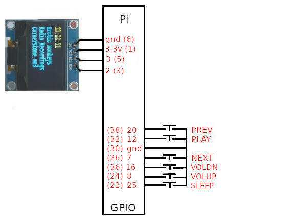

# Pi_OLED-MP3-Player

A simple MP3 Player and Internet Radio Player using a Raspberry Pi, 6 buttons, and 1 SSD1306 OLED

NOTE Use pi OS based on Bullseye, no oled driver for bookworm found yet.

All buttons are connected between gpios and gnd (1k resistors in series are usually recommended), OLED connected as shown. 

compatible with https://shop.pimoroni.com/products/audio-dac-shim-line-out?variant=32343184965715

## schematic

6 button switches, PREVIOUS,PLAY,NEXT,VOLUME DOWN, VOLUME UP,SLEEP but they have multi purposes as shown.

## GPIO BUTTONS GPIO BCM numbers (Physical pin numbers)

PREV   = 20 # (38) PREVIOUS TRACK  (whilst playing) / PREV ALBUM (whilst stopped) / PREV ARTIST (HOLD for 5 secs whilst stopped) 

PLAY   = 12 # (32) PLAY / STOP / HOLD for 5 seconds for RADIO 

NEXT   = 7  # (26) NEXT TRACK (whilst playing) / NEXT ALBUM (whilst stopped) / NEXT ARTIST (HOLD for 5 secs whilst stopped) 

VOLDN  = 16 # (36) Adjust volume DOWN whilst playing, set GAPLESS ON/OFF whilst stopped

VOLUP  = 8  # (24) Adjust volume UP whilst playing, set RANDOM ON/OFF whilst stopped

SLEEP  = 25 # (22) Set SLEEP time, HOLD for 20 seconds to SHUTDOWN, set ALBUM MODE whilst stopped.

Holding down NEXT and SLEEP will step through ARTISTS A-Z (whilst stopped)

At boot it will look for mp3 tracks in '/home/USER/Music/artist name/album_name/tracks', 
and/or on USB sticks, under /media/USER/usb_stick_name/artist name/album_name/tracks

To install copy Pi_OLED_MP3_player.py to /home/USERNAME

sudo apt-get install mplayer

sudo pip3 install mutagen

sudo apt install python3-alsaaudio

and then

 To install SSD1306 driver...
 
 git clone https://github.com/adafruit/Adafruit_Python_SSD1306.git
 
 cd Adafruit_Python_SSD1306
 
 sudo python setup.py install

 Enable I2C on Pi. Pi Menu >>  Preferences >> Raspberry Pi Configuration >> Interfaces >> I2C
 
 reboot

 setup audio output as required.

 to run at boot add /usr/bin/python3 /home/USERNAME/Pi_OLED_MP3_Player.py to /etc/xdg/lxsession/LXDE-pi/autostart

